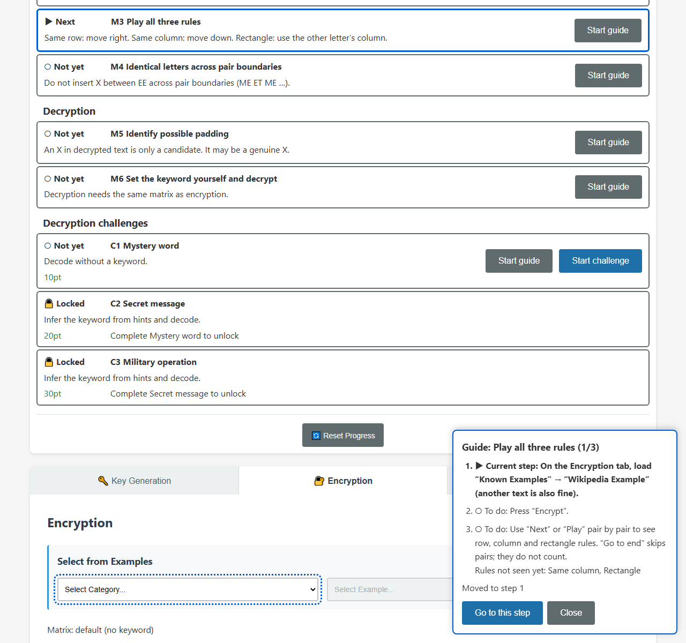
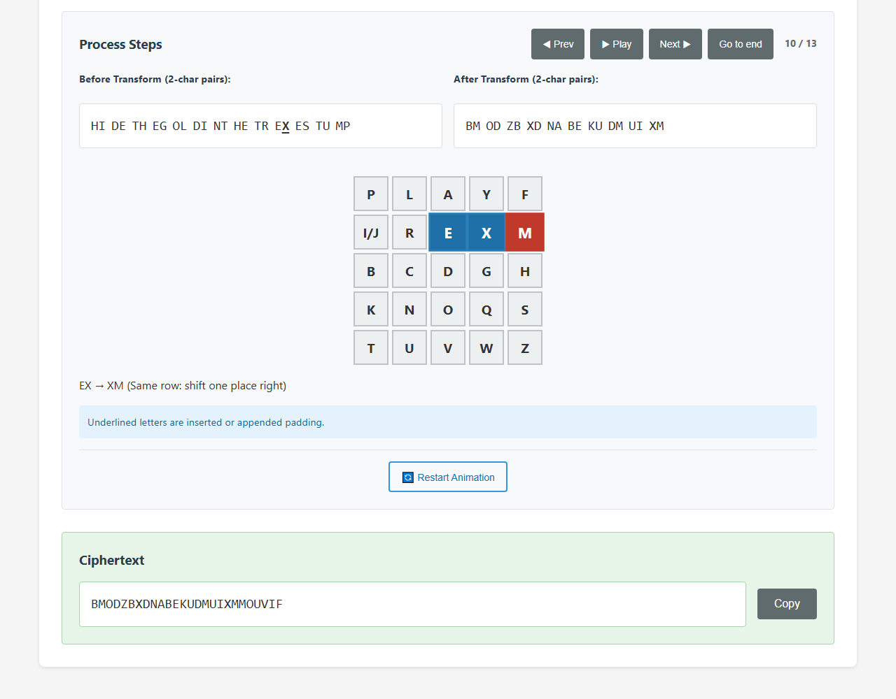
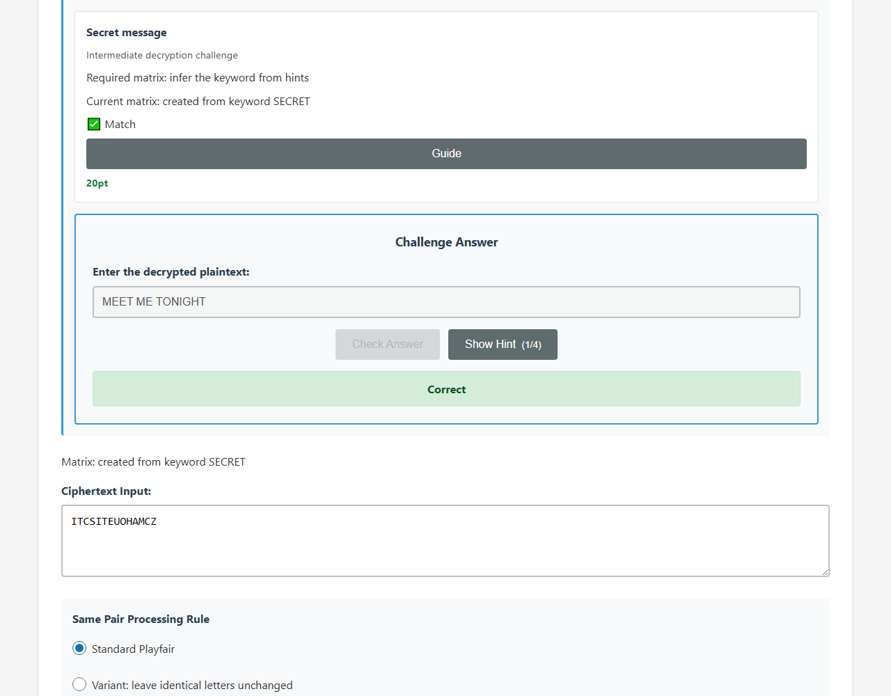

English · [日本語](README.md)

# Playfair CipherLab - Learn the Playfair cipher visually


[](https://ipusiron.github.io/playfair-cipherlab/)

**Day027 - 100 Security Tools with Generative AI**

Playfair CipherLab teaches a classical cipher with an editable 5×5 key matrix and pair-by-pair playback.
A nine-mission learning roadmap and an on-screen guide show what to do next.
The interface is available in Japanese and English, with hints for three decryption challenges.

## 🌐 Demo

[Open Playfair CipherLab in English](https://ipusiron.github.io/playfair-cipherlab/?lang=en)

You can also download the files and open index.html directly. No server or build step is required.

## 📸 Screenshots



> *M1 and M2 are complete. The M3 guide highlights the example category selector.*

1280×1200px, 88,454 bytes.



> *The PLAYFAIR EXAMPLE matrix encrypts the Wikipedia example. Pair 10/13 shows EX → XM.*

1280×1000px, 32,861 bytes.



> *C2 was loaded with “Start challenge” and solved with the SECRET matrix. The required matrix, current matrix, match and answer are visible.*

1280×1000px, 33,762 bytes.

## ✨ Features

- Nine automatically checked missions: one key-matrix mission, three encryption missions, two decryption missions and three challenges
- A recommended next mission, a step guide with focus and target outlines, and replayable guides
- Three challenges worth 10, 20 and 30 points; only the first correct answer earns points
- No penalty for guides or hints; a star for a first correct answer without decryption hints
- Keyword generation, direct 25-letter matrix entry, live previews and restoration of the default matrix
- Eight plaintext examples, three decryption practices and three decryption challenges
- Standard Playfair with X/Q/Z padding, plus three explicitly nonstandard identical-pair variants
- Padding and candidate marks; candidate-stripped text shown separately, never silently deleting genuine letters
- Independent encryption/decryption playback, with stale output hidden after key, input or setting changes
- Japanese/English, light/dark, keyboard support, reduced motion and responsive layouts
- Local progress with strict validation and migration from the old format; storage is optional

## 🗺️ Learning roadmap

| id | Group | Mission | What you learn | How to complete | Points |
|---|---|---|---|---|---|
| M1 | Key matrix | Build a matrix from a keyword | Remove repeated keyword letters, then fill with the remaining alphabet. I and J share a cell. | Save the PLAYFAIR EXAMPLE matrix | 0 |
| M2 | Encryption | See where padding is inserted | Insert X between identical letters in a pair (HELLO → HE LX LO). | Encrypt HELLO with the default matrix and standard rules | 0 |
| M3 | Encryption | Play all three rules | Same row: move right. Same column: move down. Rectangle: use the other letter’s column. | Display row, column and rectangle rules during encryption playback | 0 |
| M4 | Encryption | Identical letters across pair boundaries | Do not insert X between EE across pair boundaries (ME ET ME …). | Encrypt MEET ME TONIGHT with the default matrix and standard rules | 0 |
| M5 | Decryption | Identify possible padding | An X in decrypted text is only a candidate. It may be a genuine X. | Decrypt KCNVMP with the default matrix and standard rules | 0 |
| M6 | Decryption | Set the keyword yourself and decrypt | Decryption needs the same matrix as encryption. | Decrypt BNSY with the ANIMAL matrix and standard rules | 0 |
| C1 | Decryption challenges | Mystery word | Decode without a keyword. | Solve mystery-01 with the default matrix | 10 |
| C2 | Decryption challenges | Secret message | Infer the keyword from hints and decode. | After C1, solve mystery-02 with the SECRET matrix | 20 |
| C3 | Decryption challenges | Military operation | Infer the keyword from hints and decode. | After C2, solve mystery-03 with the MILITARY matrix | 30 |

M1–M6 can be completed in any order. “Next” recommends the first incomplete unlocked mission.
Completing everything shows 9/9 and 60/60pt, followed by a suggestion to compare the same text under variant rules.

“Start guide” opens the card at the bottom of the screen.
“Go to this step” opens the appropriate tab, outlines the control and moves focus.
It never fills in an answer, keyword or plaintext.
Steps update automatically from the current screen; completing a later step also checks earlier steps.
Close the guide with “Close” or Escape to return focus to its opener. Use “Try again” to reopen a completed mission's guide.

M3 counts only rules actually displayed as the current encryption pair.
“Go to end” and reduced motion skip pairs, so those skipped pairs do not count.
Use “Restart Animation” and then “Next” or “Play” to view the rules.
The guide's live step state is separate from saved mission achievements.

Guides and decryption hints never subtract points.
A challenge's first correct answer earns a star only if no decryption hints were shown.
Later answers do not replace the first points or hint count.
Old progress is migrated without stars because it did not record hint use.

Practice shows its keyword but never changes your matrix. Set it yourself on the Key Generation tab.
“Start challenge” loads a challenge and exposes its answer field even before decryption.
The challenge information shows the required matrix, current matrix and whether they match.

## 📖 How to use

If you are unsure where to start, open the progress panel and press “Start guide” for the “Next” mission.

### Key generation

1. Press “Edit”.
2. Enter a keyword, or choose direct matrix entry and enter 25 letters.
3. Check the preview and press “Save”.

“Restore default matrix” returns to the no-keyword matrix.
The Encryption and Decryption tabs describe the source of the current matrix.

### Encryption

1. Type plaintext or load an example.
2. Leave Same Pair Processing Mode ON for standard preparation and choose X, Q or Z as padding.
3. Press “Encrypt” and inspect the prepared pairs, rule and matrix highlights.
4. Use Previous, Next, Restart Animation, Go to end and Play/Pause to change the current pair.

Turning padding mode OFF selects a nonstandard variant.
Loading the Wikipedia example also sets the matrix to PLAYFAIR EXAMPLE.

### Decryption challenges

1. Press “Start challenge” in the roadmap, or load a challenge from the Decryption tab.
2. Read hints if needed and save the matching matrix on the Key Generation tab.
3. Press “Decrypt” and inspect the result and padding candidates.
4. Enter an answer and press “Check Answer”.

The actual matrix must match even when the answer text is correct.
Spaces and case are ignored. The original answer, prepared plaintext and candidate-stripped answer are accepted.
Appending an unrelated final letter is not accepted.

## 🧠 About the Playfair cipher

Playfair is a classical digraph substitution cipher: it transforms pairs of letters with a 5×5 key matrix.
Charles Wheatstone devised it in 1854; Lord Playfair promoted it.
It is useful for teaching classical cryptography, not for protecting modern secrets.

Treating pairs instead of single letters makes simple single-letter frequency analysis less direct.
Repeated pairs still leave statistical patterns, and modern analysis can recover keys from suitable ciphertext.
Use it for classroom demonstrations, self-study, group exercises and introductory CTF practice.

## 🔬 Rules and known answers

Normalize to uppercase, merge J into I and discard nonletters.
Read left to right in pairs. Split identical letters only within the current pair and pad an odd final letter.
Do not split identical letters across pair boundaries: SEEN stays SE EN.

Padding may be X, Q or Z. If the source letter equals the selected padding, use Q for X and X for other padding.
For the same row move right; for the same column move down; for a rectangle exchange columns.
Wrap at matrix edges. Decryption moves left or up.

| Keyword | Plaintext | Prepared text | Ciphertext |
|---|---|---|---|
| Default | HELLO | HELXLO | KCNVMP |
| Default | SEEN | SEEN | UCCP |
| Default | BALLOON | BALXLOON | CBNVMPPO |
| Default | FOXX | FOXQXQ | ILVSVS |
| PLAYFAIR EXAMPLE | HIDE THE GOLD IN THE TREE STUMP | HIDETHEGOLDINTHETREXESTUMP | BMODZBXDNABEKUDMUIXMMOUVIF |

The default matrix is `ABCDEFGHIKLMNOPQRSTUVWXYZ`.
Leave-unchanged, right-shift and bottom-right identical-pair handling are nonstandard variants.

Decryption cannot reliably distinguish padding from genuine letters.
An X at the end of THE QUICK BROWN FOX is genuine but still looks like a candidate.
The candidate-stripped result is not a guarantee of the original text.

Standard ciphertext has no identical-letter pair.
With the same matrix, reversing the order within a pair reverses its encrypted pair.
These properties concern two-letter pairs, not arbitrary adjacent letters or an entire message.

## 🏆 Challenges

C1 is initially available. C1 unlocks C2; C2 unlocks C3.
M1–M6 are not prerequisites for the challenges.

| Level | Title | Ciphertext | Keyword | Points |
|---|---|---|---|---|
| 1 | Mystery word | KCNVMP | Default | 10 |
| 2 | Secret message | ITCSITEUOHAMCZ | SECRET | 20 |
| 3 | Military operation | MAAMDHMAKDUP | MILITARY | 30 |

<details>
<summary>Level 1: Mystery word — answer and hints</summary>

Answer: `HELLO`.

- A word used as a greeting
- Do not set a keyword; use the default matrix
- A five-letter English word
- Decryption contains one padding X

</details>

<details>
<summary>Level 2: Secret message — answer and hints</summary>

Answer: `MEET ME TONIGHT`.

- Build the key matrix from the English word meaning secret
- A sentence about meeting someone
- It contains three words
- Spaces and letter case do not matter in your answer

</details>

<details>
<summary>Level 3: Military operation — answer and hints</summary>

Answer: `ATTACK AT DAWN`.

- Build the key matrix from an English word related to the military
- The keyword has eight letters
- A common example in cryptography textbooks
- It contains a word referring to a time of day

</details>

## 🔒 Security

All cipher operations run in the browser with no runtime API, CDN, external font or dependency.
Playfair is an educational classical cipher and must not be used to protect secrets.

The meta CSP allows scripts and styles only from self, without unsafe-inline.
The referrer policy is no-referrer. Dynamic content uses DOM APIs and textContent.
Only fixed dictionary help/footer templates use HTML insertion.
There are no style attributes or inline handlers. Unsupported meta frame-ancestors is not added.

Only progress, language and theme are saved in the same browser.
Keys and input/output text are never saved. Storage failures do not prevent use, but changes then last only for the current page.
A failed clipboard write produces a failure notification.

Initial language follows a valid `?lang=ja|en`, then a saved choice, then the browser language (Japanese for ja, English otherwise).
A URL override is not automatically saved; only the language toggle saves a choice.

## 🔗 References

- [Wikipedia: Playfair cipher](https://en.wikipedia.org/wiki/Playfair_cipher)
- 『暗号の秘密』, pp. 70–72
- 『暗号解読事典』, pp. 181–183
- 『暗号事典』, pp. 556–559

## 🧪 Tests

Use Node.js 22 or newer. Do not install dependencies.

```bash
npm test
```

GitHub Actions runs the tests on push and pull_request.
Both READMEs are checked against ProgressCore, PlayfairCore, exercise data and dictionaries:
nine missions, five known answers, three challenges and their exact hints.

| Test file | Coverage |
|---|---|
| test/cipher.test.js | Matrices, preparation, standard rules, variants, candidates and 200 seeded roundtrips |
| test/exercises.test.js | Six exercises, answer acceptance/rejection and side-effect-free points |
| test/progress.test.js | Mission events, migration, locks, stars, guide steps and blocked storage |
| test/i18n.test.js | Matching keys, translations, initial language and help |
| test/html.test.js | CSP, referrer, ARIA, labels, guide structure and inline attribute restrictions |
| test/contrast.test.js | Light/dark text combinations and guide outline contrast |
| test/format.test.js | Maximum line lengths and readable source line counts |
| test/readme.test.js | Bilingual tables, hints, YAML structure, complete trees and image references |

## 📁 Directory structure

```text
playfair-cipherlab/                # Project root
├── .github/                       # GitHub configuration
│   └── workflows/                 # GitHub Actions workflows
│       └── test.yml               # Run npm test on push and pull_request with Node 22
├── .gitignore                     # Ignored local files
├── .nojekyll                      # Disable Jekyll processing
├── CLAUDE.md                      # Architecture, rules and development guidance
├── LICENSE                        # MIT license
├── README.md                      # Japanese usage, rules, known answers and tests
├── README.en.md                   # English README
├── package.json                   # Dependency-free npm test command
├── index.html                     # Three tabs, playback, guide, help and meta CSP
├── assets/                        # README screenshots
│   ├── en/                        # English README screenshots
│   │   ├── screenshot.png         # English roadmap and M3 guide
│   │   ├── screenshot2.png        # English Wikipedia playback at pair 10
│   │   └── screenshot3.png        # English C2 matrix match and correct answer
│   ├── screenshot.png             # Japanese Wikipedia playback at pair 10
│   ├── screenshot2.png            # Japanese C2 matrix match and correct answer
│   ├── screenshot3.png            # Dark English keyword preview
│   └── screenshot4.png            # Japanese roadmap and M3 guide
├── css/                           # Stylesheets
│   └── styles.css                 # Light/dark colors and responsive layout
├── js/                            # Classic scripts compatible with file URLs
│   ├── cipher.js                  # Pure standard cipher, variants and padding candidates
│   ├── exercises.js               # Examples, exercises and pure answer validation
│   ├── progress.js                # Pure missions, completion rules and storage migration
│   ├── guide.js                   # Guide card and Go to this step navigation
│   ├── ui.js                      # Tabs, matrix editing, playback, exercises and progress recording
│   ├── i18n.js                    # Japanese/English dictionaries, initial language and switching
│   ├── theme-init.js              # Apply the theme before the first paint
│   ├── theme.js                   # Theme switching
│   ├── help.js                    # Help dialog
│   └── main.js                    # Startup
└── test/                          # Automated tests using node --test
    ├── cipher.test.js             # Matrices, preparation, variants, roundtrips and candidates
    ├── exercises.test.js          # Exercise data and answer validation
    ├── i18n.test.js               # Dictionary coverage, language choice, literal policy and help
    ├── html.test.js               # CSP, referrer, ARIA, structure and attributes
    ├── contrast.test.js           # All 18 light/dark text contrast pairs
    ├── format.test.js             # Line length and readable source line counts
    ├── progress.test.js           # Missions, migration, locks, guide steps and storage exceptions
    └── readme.test.js             # Bilingual tables, YAML, trees and images
```

## 💻 Requirements

A modern browser with HTML5, CSS3 and JavaScript.
No build step is needed. The tool works over HTTP and directly from file://.
Checks use the existing Chromium at 1280, 768, 390 and 320px in both languages.

```bash
python -m http.server 8000
```

## 📄 License

MIT License. See [LICENSE](LICENSE).

## 🛠️ About this tool

This tool is part of the **100 Security Tools with Generative AI** project.
The project develops and publishes security tools with AI assistance over 100 days, covering classical and modern cryptography, networking and malware analysis.

[Project details and other tools](https://akademeia.info/?page_id=42163)
