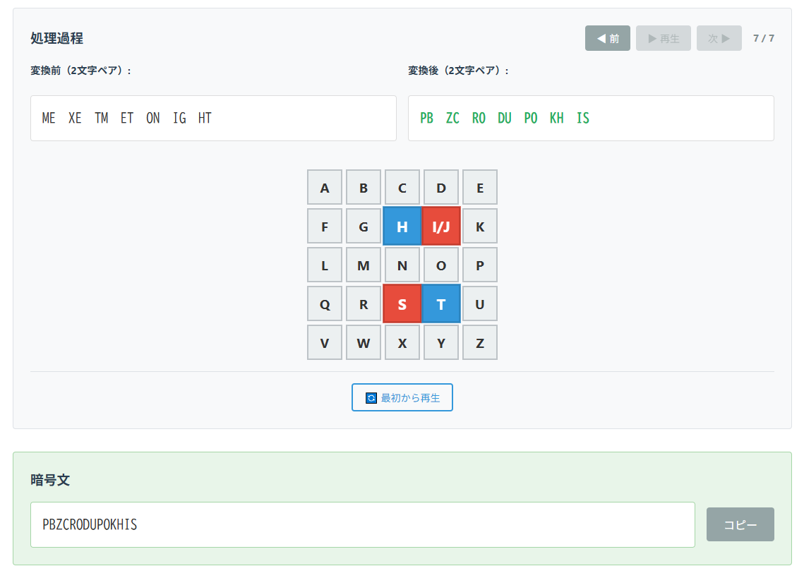

<!--
---
id: day027
slug: playfair-cipherlab

title: "Playfair CipherLab"

subtitle_ja: "ビジュアルで学ぶプレイフェア暗号ツール"
subtitle_en: "Visual Learning Tool for Playfair Cipher"

description_ja: "プレイフェア暗号の暗号化・復号過程をステップバイステップのアニメーションで視覚的に学べる教育ツール。段階的なチャレンジシステムとヒント機能で、古典暗号の仕組みを楽しく理解できます。"
description_en: "An educational tool to visually learn the Playfair cipher encryption and decryption process through step-by-step animations. Features a progressive challenge system with hints to help understand classical cryptography concepts."

category_ja:
  - 古典暗号
  - 換字式暗号
category_en:
  - Classical Cryptography
  - Substitution Cipher

difficulty: 2

tags:
  - visualization
  - education
  - ctf

repo_url: "https://github.com/ipusiron/playfair-cipherlab"
demo_url: "https://ipusiron.github.io/playfair-cipherlab/"

hub: true
---
-->

# Playfair CipherLab - ビジュアルで学ぶプレイフェア暗号ツール


**Day027 - 生成AIで作るセキュリティツール100**

**Playfair CipherLab** は、古典暗号の一種であるプレイフェア暗号を視覚的に学べるWebツールです。

- 🎯 **段階的学習システム**: 進捗管理付きのチャレンジで楽しく学習
- 🎬 **詳細なアニメーション**: ステップバイステップの暗号化・復号過程を視覚化
- 🔑 **キーワード対応**: 英単語から鍵マトリクスを自動生成
- 💡 **ヒントシステム**: 段階的にヒントを提供して解読をサポート
- 🌐 **多言語対応**: 日本語・英語の完全対応（JA/ENボタンで切り替え）
- 🌙 **ダークモード**: 目に優しいダークモードに対応

---

## 🔗 デモページ

👉 [https://ipusiron.github.io/playfair-cipherlab/](https://ipusiron.github.io/playfair-cipherlab/)

---

## 📸 スクリーンショット

>
>
>*暗号化処理で鍵マトリクスをアニメーション点灯*

---

## 🎯 対象ユーザー

- 暗号理論に興味を持ち始めた **初心者〜初学者**
- プレイフェア暗号の動作を **視覚的に理解したい学習者**
- 情報セキュリティや古典暗号の教育を行う **教員・講師**
- CTFや謎解きで暗号解読に挑戦したい **競技志向のユーザー**

---

## 🧩 主な機能

### 📊 学習進捗管理
- **ポイントシステム**: チャレンジクリアでポイント獲得（10pt/20pt/30pt）
- **レベル制限**: 前レベル完了で次レベル解放
- **進捗表示**: アコーディオン式の進捗パネルで学習状況を一目で確認
- **自動保存**: ブラウザーに進捗を自動保存、リセット機能つき

---
### 🔑 鍵生成
- **2つの編集モード**: キーワード指定 / マトリクス直接入力
- **キーワード自動生成**: 英単語から5×5マトリクスを自動構築
- **リアルタイムプレビュー**: キーワード入力時にマトリクスをプレビュー表示
- **入力検証**: J→I変換、重複チェック、文字数検証

---
### 🔐 暗号化
- **例文システム**: カテゴリ別（基本単語/定型文/歴史的文書）の豊富な例文
- **柔軟な同一ペア処理**: 
  - 補完文字挿入モード（X/Q/Z選択可）
  - 特別ルールモード（変化なし/右隣置換/対角移動）
- **詳細なアニメーション制御**: 再生/停止/前へ/次へボタンで自由操作
- **中間状態表示**: 変換前後の2文字ペアを段階的に表示

---
### 🔓 復号
- **練習・チャレンジ選択**: 復号練習と解読チャレンジを分離
- **3段階のチャレンジ**:
  - レベル1: デフォルト鍵での基本復号（10pt）
  - レベル2: SECRET鍵での中級復号（20pt）  
  - レベル3: MILITARY鍵での上級復号（30pt）
- **段階的ヒントシステム**: 
  - ヒント数表示（例: 1/4）
  - 複数回クリックで次のヒント表示
  - 全表示後の完了表示
- **柔軟な解答検証**: 埋め文字の有無を考慮した判定

---
### 🎬 アニメーション機能
- **ステップバイステップ制御**: 前/再生/次/リスタートボタン
- **マトリクスハイライト**: 対応ペアの位置を視覚的に表示
- **進捗表示**: 現在ステップ/総ステップ数の表示
- **自動・手動切り替え**: 自動再生と手動ステップ送りの両方に対応

---
### 🌐 多言語対応
- **完全な日英対応**: UIのすべての要素が翻訳対応
- **動的言語切り替え**: JA/ENボタンでリアルタイム切り替え
- **言語設定の保存**: 選択した言語はブラウザーに保存
- **コンテンツ翻訳**: 例文タイトル、チャレンジ説明、ヒントも翻訳

---

## 🧠 プレイフェア暗号とは？

**プレイフェア暗号（Playfair cipher）** は、19世紀半ばに考案された古典暗号の一種です。

平文を数文字ずつに区切って、そのグループごとに<ruby>換字<rt>かえじ</rt></ruby>するタイプの暗号を、<ruby>綴字<rt>つづりじ</rt></ruby>暗号といいます。
プレイフェア暗号も綴字暗号の一種であり、2文字ペア（ダイグラフ：digraph）で区切ります。

**2文字単位の文字変換（digraph substitution）** を用いる点で、より単純な換字式暗号よりも高い複雑性を持ちます。

---

### 🔎 背景と歴史

この暗号は **チャールズ・ホイートストン（Charles Wheatstone）** によって1854年に発明されましたが、彼の友人であった **プレイフェア男爵（Lord Playfair）** が紹介したことで評判が高まったので、プレイフェア暗号という名で広く知られるようになりました。

イギリス軍では第一次世界大戦および第二次世界大戦でも一定期間採用された実績があり、**手軽に使える割に強力な暗号** として評価されていました。

---

### ⚙ 仕組みの概要

プレイフェア暗号は、**5×5のマトリクス（鍵表）** を用いて文字ペアごとに暗号化を行います。
アルファベットのうち `I` と `J` を統合して25文字に圧縮し、以下のような処理を行います：

| 2文字の位置関係 | 処理方法 |
|----------------|----------|
| 同じ行         | 右に1文字ずらす（右端は左端へ） |
| 同じ列         | 下に1文字ずらす（下端は上端へ） |
| 長方形（異なる行・列）| 対角線で相手の列を交換 |

また、暗号化の際に、同一文字のペアだった場合や、終端が1文字になってしまう場合には、`X`や`Z`などの補完文字（埋め文字）を挿入して調整します。

---

### 🧭 古典暗号における位置づけ

プレイフェア暗号は、以下の点で単純な換字式暗号（Caesar, Monoalphabetic）よりも高度です：

- **ペア単位の換字** により、頻度分析を難しくする  
- 1文字ずつではなく **2文字ずつ扱う** ことで、アルファベット単体の頻度分析が通用しない  
- 鍵として使うマトリクスが **構造的に視覚的** で、教育向けにも適している

このため、プレイフェア暗号は古典暗号における **中級レベルの教育暗号** として位置づけられています。

---

### 🧩 解読のされやすさと弱点

プレイフェア暗号は、以下のような **構造的な強みと弱み** を持っています：

---
#### ✅ 強み

- シンプルな頻度分析では解読が困難
- 2文字単位の換字により、1文字単位の推測を困難にする
- キーワードによる柔軟な鍵生成が可能。鍵マトリクス全体を記憶するのは難しいが、キーワードなら覚えやすい。

---
#### ⚠️ 弱み

- 暗号化ルールが単純であるため、**十分な量の暗号文があれば総当たりでの推測が可能**
- **同じ平文ペア → 同じ暗号ペア** となるため、パターンが現れやすい
- **2文字単位の構造** は、暗号文中に現れる「頻出ペア」などの統計情報に弱い

現在ではコンピューターによって **容易に解読可能な暗号** とされており、**実用性はほとんどありません** が、教育用途やCTFなどでは頻繁に登場します。

---

### 参考図書

- 『暗号の秘密』P.70-72
- 『暗号解読事典』P.181-183
- 『暗号事典』P.556-559

---

## 🎮 使い方ガイド

### Step 1: 🔑 鍵生成
1. **編集ボタン**をクリック
2. **編集モード**を選択：
   - **キーワード指定**: 英単語を入力（例: "PLAYFAIR", "SECRET"）
   - **マトリクス指定**: 25文字を直接入力
3. **保存**して鍵マトリクスを確定

### Step 2: 🔐 暗号化で学習
1. **例文選択**でカテゴリから学習用テキストを選択
2. **同一ペア処理モード**を設定：
   - **ON**: 補完文字（X/Q/Z）を挿入
   - **OFF**: 特別ルール（変化なし/右隣置換/対角移動）を選択
3. **暗号化ボタン**を押してアニメーション開始
4. **制御ボタン**で詳細確認：
   - ▶ 再生/⏸ 停止
   - ◀ 前 / 次 ▶
   - 🔄 最初から再生

### Step 3: 🔓 復号でチャレンジ
1. **練習・課題選択**で「解読チャレンジ」を選択
2. レベルに応じたチャレンジを選択（レベル制限あり）
3. **復号ボタン**でアニメーション確認
4. **解答入力**で答えを入力
5. **ヒントボタン**で段階的にヒントを表示
6. **解答チェック**でポイント獲得

---
### 🏆 進捗管理
- 上部の**進捗パネル**で学習状況を確認
- チャレンジクリアでポイント獲得
- レベル内全チャレンジクリアで次レベル解放
- 必要に応じて**進捗リセット**が可能

---

## 📁 ファイル構成

```
playfair-cipherlab/
├── index.html           # メインHTMLファイル
├── css/
│   └── styles.css       # スタイルシート（ダークモード対応）
├── js/
│   ├── main.js          # エントリーポイント
│   ├── ui.js            # UIコントローラー（メイン、1600行超の中核ファイル）
│   ├── cipher.js        # Playfair暗号アルゴリズム実装
│   ├── exercises.js     # 例文・チャレンジデータ管理
│   ├── animations.js    # アニメーション制御
│   ├── theme.js         # ダークモード切り替え
│   ├── help.js          # ヘルプモーダル制御
│   └── i18n.js          # 国際化（日英翻訳）システム（730行超、完全翻訳対応）
├── assets/
│   └── screenshot.png   # スクリーンショット画像
├── README.md            # このファイル
└── LICENSE              # MITライセンス
```

---

## 📋 詳細仕様

### 暗号化ルール
| 位置関係 | 処理方法 |
|---------|----------|
| 同一行 | 右シフト（末尾→先頭） |
| 同一列 | 下シフト（末尾→上） |
| 長方形 | 対角線交換 |

---
### 同一ペア処理
| モード | 処理内容 |
|--------|----------|
| 補完文字挿入 | 同一文字間にX/Q/Zを挿入 |
| 変化なし | そのまま処理 |
| 右隣置換 | 右隣の文字に置換 |
| 対角移動 | 1つ右、1つ下に移動 |

---
### チャレンジ一覧

<details>
<summary>💡 クリックしてチャレンジ詳細を表示（ネタバレ注意）</summary>

| レベル | タイトル | 暗号文 | キーワード | ポイント |
|--------|----------|--------|------------|-----------|
| 1 | 謎の単語 | KCMMNY | なし（デフォルト） | 10pt |
| 2 | 秘密のメッセージ | ITWCGUCSPOMBMS | SECRET | 20pt |
| 3 | 軍事作戦 | MAAMDHMAKDUP | MILITARY | 30pt |

---
#### 🔍 チャレンジのヒント

<details>
<summary>レベル1: 謎の単語</summary>

- ヒント1: 3文字以下の短い単語ではありません
- ヒント2: 挨拶に使われる言葉です
- ヒント3: デフォルトの鍵が使われています
- ヒント4: 5文字の基本的な英単語です
- 答え: HELLO

</details>

<details>
<summary>レベル2: 秘密のメッセージ</summary>

- ヒント1: 鍵マトリクスは「秘密」という意味の英単語をキーワードに生成しています
- ヒント2: 待ち合わせに関する文章
- ヒント3: 3つの単語で構成されています
- ヒント4: 適切なスペースで単語を区切って入力してください
- 答え: MEET ME TONIGHT

</details>

<details>
<summary>レベル3: 軍事作戦</summary>

- ヒント1: 軍事関連のキーワードです
- ヒント2: 第二次大戦に関連するキーワードです
- ヒント3: キーワードは8文字です
- ヒント4: キーワード: MILITARY
- 答え: ATTACK DAWN

</details>

</details>

---
### フロントエンド
- **HTML5/CSS3/JavaScript (ES6+)**: モダンなWeb技術で構築
- **Vanilla JavaScript**: フレームワーク不要のシンプル実装
- **CSS Grid/Flexbox**: レスポンシブ対応のレイアウト
- **LocalStorage**: 進捗データの永続化

---
### 機能要件
| 項目 | 内容 |
|------|------|
| マトリクス構成 | A〜Z から J を除いた25文字。I/Jは統合、表示は "I/J" |
| 補完文字 | X/Q/Z から選択可能。暗号化末尾または同一ペア分割時に使用 |
| 文字変換 | 入力：大文字小文字混在可、暗号文出力：大文字、復号結果：小文字 |
| 無効文字処理 | 非アルファベット文字は自動除去（警告表示あり） |
| 進捗管理 | LocalStorageで自動保存、ブラウザー間で保持 |

---
### ユーザビリティ
- 📱 **レスポンシブ対応**: モバイル・タブレット・PC対応
- 🎨 **ダークモード**: 目に優しいダークテーマ切り替え
- 🌐 **多言語UI**: 日本語・英語の完全対応、動的切り替え
- ♿ **アクセシビリティ**: キーボード操作、ARIA対応
- 🔊 **フィードバック**: トースト通知、アニメーション、音声なし設計
- 💾 **データ永続化**: 進捗・言語設定自動保存、ページリロード対応

---

## 📚 教育利用

### 対象レベル
- **中学生〜高校生**: 情報科目での暗号学習
- **大学生**: 情報セキュリティ入門課程
- **一般向け**: プログラミング教育、STEAM教育

---
### 活用シーン
- 📖 **授業での演示**: プロジェクター投影でのデモンストレーション
- 💻 **個人学習**: 自分のペースでの暗号理解
- 👥 **グループワーク**: チーム対抗での暗号解読競技
- 🏆 **コンテスト**: CTF初心者向けの練習問題

---

## 📄 ライセンス

MIT License - 詳細は[LICENSE](LICENSE)をご覧ください。

---

## 🛠 プロジェクトについて

本ツールは、**「生成AIで作るセキュリティツール100」プロジェクト**の一環として開発されました。

このプロジェクトでは、AIの支援を活用しながら、セキュリティに関連するさまざまなツールを100日間にわたり制作・公開しています。
古典暗号から現代暗号、ネットワークセキュリティ、マルウェア解析まで、幅広いセキュリティ分野をカバーする実用的なツール群を提供しています。

🔗 [https://akademeia.info/?page_id=42163](https://akademeia.info/?page_id=42163)

