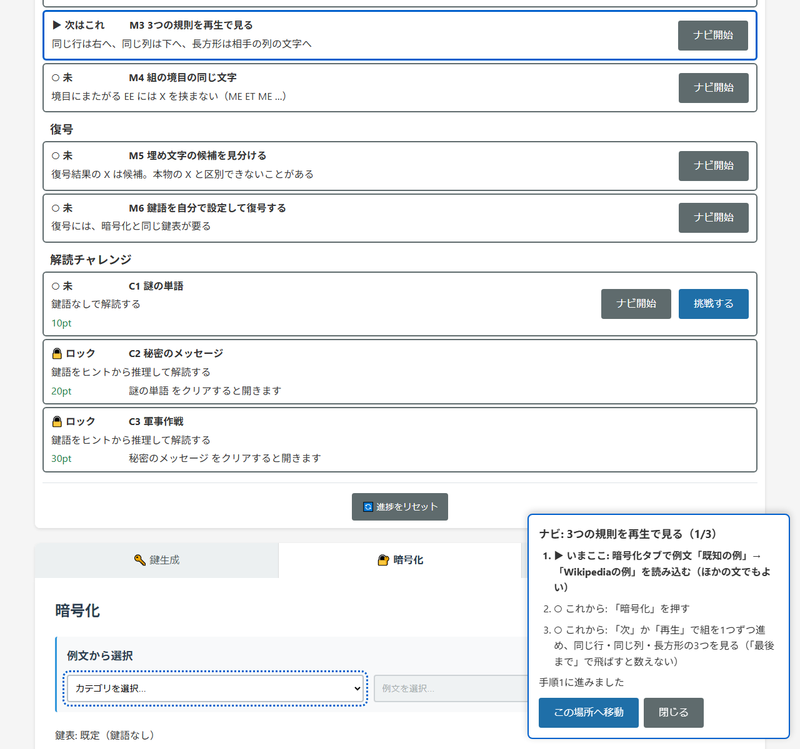
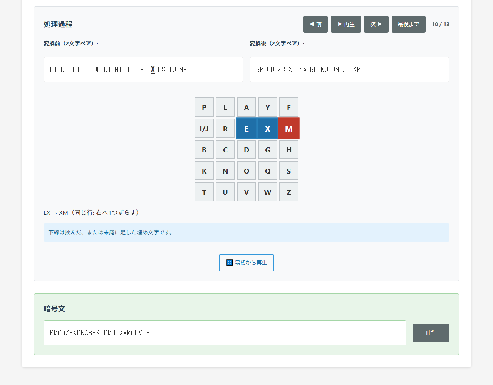
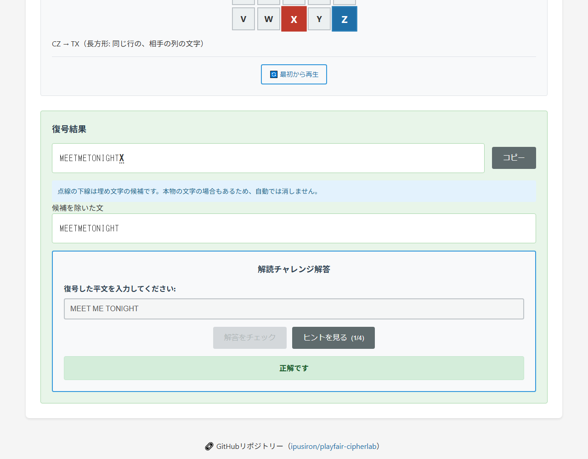
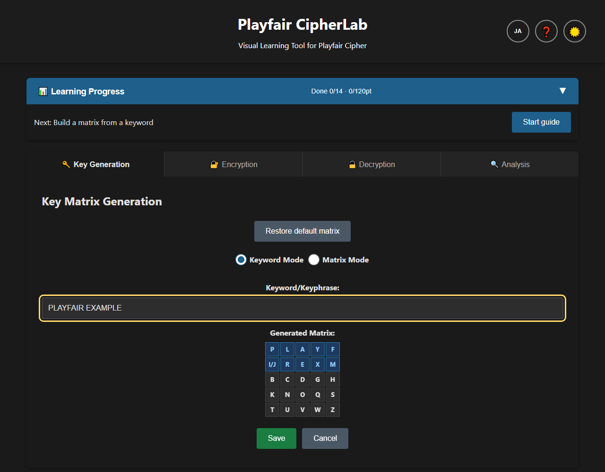
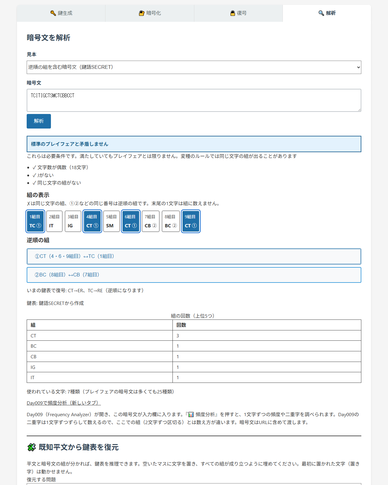

<!--
---
id: day027
slug: playfair-cipherlab

title: "Playfair CipherLab"

subtitle_ja: "ビジュアルで学ぶプレイフェア暗号ツール"
subtitle_en: "Visual Learning Tool for Playfair Cipher"

description_ja: "プレイフェア暗号の暗号化・復号過程をステップバイステップのアニメーションで視覚的に学べる教育ツール。段階的なチャレンジシステムとヒント機能で、古典暗号の仕組みを楽しく理解できます。"
description_en: "An educational tool to visually learn the Playfair cipher encryption and decryption process through step-by-step animations. Features a progressive challenge system with hints to help understand classical cryptography concepts."

category_ja:
  - 古典暗号
  - 換字式暗号
category_en:
  - Classical Cryptography
  - Substitution Cipher

difficulty: 2

tags:
  - visualization
  - education
  - ctf

repo_url: "https://github.com/ipusiron/playfair-cipherlab"
demo_url: "https://ipusiron.github.io/playfair-cipherlab/"

hub: true
---
-->

[English](README.en.md) · 日本語

# Playfair CipherLab - ビジュアルで学ぶプレイフェア暗号ツール


[](https://ipusiron.github.io/playfair-cipherlab/)

**Day027 - 生成AIで作るセキュリティツール100**

Playfair CipherLabは、古典暗号の一種であるプレイフェア暗号を視覚的に学べるWebツールです。
5×5の鍵表を作り、暗号化・復号を2文字の組ごとに再生できます。
日本語・英語の画面、暗号文の解析、11ミッションの学習ロードマップ、操作場所を示すナビ、ヒント付きの解読チャレンジを備えています。

## 🌐 デモページ

👉 [Playfair CipherLabを開く](https://ipusiron.github.io/playfair-cipherlab/)

ブラウザーで直接利用できます。ダウンロードしたindex.htmlを直接開くこともできます。

## 📸 スクリーンショット



> *M1・M2を達成し、M3のナビで例文のセレクトを強調した状態です。*

1280×1800px、204,901バイト。



> *PLAYFAIR EXAMPLEの鍵表でWikipediaの例を暗号化し、10/13組目のEX→XMを表示しています。*

1280×1000px、39,277バイト。



> *「挑戦する」でmystery-02を読み込み、SECRETの鍵表で正解した状態です。必要な鍵表、いまの鍵表、一致の印と解答欄を示しています。*

1280×1000px、56,291バイト。



> *英語・ダーク表示でPLAYFAIR EXAMPLEを入力し、鍵語由来の文字を色分けしています。*

1280×1000px、45,670バイト。



> *SECRETの鍵表でTCITIGCTSMCTCBBCCTを解析し、①を選択。CT→ER、TC→REと逆順になることを表示しています。*

1280×1600px、112,094バイト。

## ✨ 機能

### 📊 学習進捗管理

- チャレンジ3問の得点管理（10・20・30点、各問1回だけ加算）
- 11ミッション（鍵表1・暗号化3・復号2・解析2・チャレンジ3）の達成・次・未・ロックと、おすすめの次の操作
- 操作で手順を自動判定するナビと、ヒントなしの初回正解を示す★
- C1→C2→C3のロック解除と、確認ダイアログ付きの進捗リセット
- 同じブラウザー内への進捗保存。保存値の厳密な検証と旧形式からの移行。保存できない場合もページ内で利用可能

### 🔑 鍵生成

- キーワード指定と25文字のマトリクス直接入力
- 5×5の表のリアルタイムプレビュー
- J→Iの統合、重複・文字数の検証

### 🔐 暗号化・復号

- 標準のプレイフェア暗号とX・Q・Zからの埋め文字選択
- 標準ではない3つの変種（変化なし・右隣置換・対角移動）
- 8つの例文、復号練習3問、解読チャレンジ3問
- 埋め文字を自動で削除しない復号結果と、候補の印・候補を除いた文

### 🔍 解析

- 文字数が偶数、Jがない、同じ文字の組がないという3つの必要条件の検査
- 「標準のプレイフェアではあり得ません」「標準のプレイフェアと矛盾しません」の判定と、その根拠
- 番号つきの組、逆順の組を結ぶバッジと一覧、いまの鍵表で逆順になる復号の表示
- 組の回数の上位5つ、文字の種類数、無視した文字の表示
- 暗号化の出力・復号の入力から解析へ送る操作。入力や見本を変えたら古い結果を非表示

### 🎬 再生と表示

- 前・再生／停止・次・最初から・最後までの操作
- 組の規則の説明、埋め文字の下線、最大4セルのハイライト
- 暗号化・復号の独立した再生状態と、鍵・入力・設定変更時の古い結果の非表示
- 日本語・英語、ライト・ダーク、キーボード操作、モバイル表示
- 動きを減らす設定では自動再生せず、全組の結果を表示

## 🗺️ 学習ロードマップ

| id | 段 | ミッション | 学べること | 達成のしかた | 点 |
|---|---|---|---|---|---|
| M1 | 鍵表 | 鍵語から鍵表を作る | 鍵語の文字を重複なしで並べ、残りのアルファベットで埋める。IとJは同じマス | PLAYFAIR EXAMPLEの鍵表を保存 | 0 |
| M2 | 暗号化 | 埋め文字が入るところを見る | 組の2文字が同じならXを挟む（HELLO → HE LX LO） | 既定の表・標準の規則でHELLOを暗号化 | 0 |
| M3 | 暗号化 | 3つの規則を再生で見る | 同じ行は右へ、同じ列は下へ、長方形は相手の列の文字へ | 暗号化の再生で行・列・長方形の3規則を実際に表示 | 0 |
| M4 | 暗号化 | 組の境目の同じ文字 | 境目にまたがるEEにはXを挟まない（ME ET ME …） | 既定の表・標準の規則でMEET ME TONIGHTを暗号化 | 0 |
| M5 | 復号 | 埋め文字の候補を見分ける | 復号結果のXは候補。本物のXと区別できないことがある | 既定の表・標準の規則でKCNVMPを復号 | 0 |
| M6 | 復号 | 鍵語を自分で設定して復号する | 復号には、暗号化と同じ鍵表が要る | ANIMALの表・標準の規則でBNSYを復号 | 0 |
| M7 | 解析 | プレイフェアではあり得ない暗号文を見分ける | 奇数の文字数、J、同じ文字の組は標準では作れない | 「あり得ない」と判定される文を解析 | 0 |
| M8 | 解析 | 逆順の組を見つける | 暗号文のABとBAは、平文でも逆順の組になる | 逆順の組の一覧から1つ選ぶ | 0 |
| C1 | 解読チャレンジ | 謎の単語 | 鍵語なしで解読する | mystery-01に既定の表で正解 | 10 |
| C2 | 解読チャレンジ | 秘密のメッセージ | 鍵語をヒントから推理して解読する | C1のあと、mystery-02にSECRETの表で正解 | 20 |
| C3 | 解読チャレンジ | 軍事作戦 | 鍵語をヒントから推理して解読する | C2のあと、mystery-03にMILITARYの表で正解 | 30 |

M1〜M8は順番を強制しません。「次はこれ」は未達成でロックされていない最初のミッションです。
すべて達成すると11/11・60/60ptになり、同じ文を変種で暗号化して比べる案内を表示します。

帯や各ミッションの「ナビ開始」を押すと、下のカードに手順が出ます。
「この場所へ移動」は対象のタブを開き、押す場所を枠で示してフォーカスを移します。
答え・鍵語・平文は自動入力しません。
操作が済むと手順に印が付き、あとの手順を先に済ませた場合は前の手順も済みになります。
「閉じる」かEscで閉じると、開いたボタンへ戻ります。達成済みの行は「もう一度」でナビを開けます。

M3では実際に「いまの組」として表示した規則だけを数えます。
「最後まで」や動きを減らす設定で飛ばした組は数えません。「最初から」で戻し、「次」か「再生」で進めてください。
ナビの手順は現在の画面で判定し、保存する達成記録とは分けています。

ナビも解読ヒントも減点しません。解読ヒントを見ずに初回正解した課題には★が付きます。
再正解しても最初の得点とヒント数は変わりません。旧形式の進捗は移行しますが、ヒント使用の記録がないため★は付きません。

復号練習は必要な鍵語を表示しますが、鍵表を自動では変えません。鍵生成タブで自分で設定します。
解読チャレンジは「挑戦する」で読み込めます。解答欄は復号前から使え、必要な鍵表といまの鍵表の一致を確認できます。

## 📖 使い方

迷ったら進捗パネルの「次はこれ」の「ナビ開始」を押してください。

### 🔑 鍵生成

1. 「編集」を押す。
2. キーワード指定で英単語を入力するか、マトリクス指定で25文字を入力する。
3. プレビューを確認し、「保存」で鍵表を確定する。

鍵語なしの既定の表に戻す場合は、「既定の表に戻す」を押します。暗号化・復号タブには、いまの鍵表の出どころを表示します。

### 🔐 暗号化で学習

1. 平文を入力するか、カテゴリから例文を選んで読み込む。
2. 標準では補完文字挿入をオンにし、埋め文字を選ぶ。
3. 「暗号化」を押し、各組の説明と鍵表の位置を見る。
4. 前・次・最初から・最後までで表示位置を変え、再生／停止で自動送りを切り替える。

補完文字挿入をオフにした場合は変種です。「既知の例」のWikipediaの文を読み込むと、鍵表もPLAYFAIR EXAMPLEに変わります。

### 🔓 復号でチャレンジ

1. 進捗パネルの「挑戦する」で解読チャレンジを読み込む（復号タブの課題選択からも読み込める）。
2. ヒントを読み、「鍵生成」で課題に対応する鍵表を保存する。
3. 「復号」を押して、復号結果と埋め文字の候補を確認する。
4. 解答を入力して「解答をチェック」を押す。

解答が合っていても鍵表が違えば正解になりません。空白や大文字・小文字は問いません。
元の答え、埋め文字を含む復号結果、候補を除いた文のいずれかを受け付けますが、無関係な末尾の文字を足した解答は受け付けません。

### 🔍 暗号文を解析

1. 「🔍 解析」タブで暗号文を入力するか、見本を選ぶ。
2. 「解析」を押し、判定の帯と3条件の結果、組の印を見る。
3. 逆順の組があれば、一覧から1つ選び、同じ番号のバッジと現在の鍵表での復号を見る。

見本は、鍵語SECRETの逆順の組を含む文、Wikipediaの例の暗号文、シーザー暗号の文（Khoor, Zruog!）です。
暗号化の出力や復号の入力の「解析へ送る」でも、文字列を移して解析できます。
JはIに置き換えず検査します。空白は除き、それ以外の英字でない文字は無視した文字として表示します。
鍵表は自動では変えません。SECRETの例を同じ復号結果で確かめるには、鍵生成タブでSECRETの表を保存してください。

## 🧠 プレイフェア暗号とは

**プレイフェア暗号（Playfair cipher）** は、19世紀半ばに考案された古典暗号の一種です。

平文を数文字ずつに区切って、そのグループごとに<ruby>換字<rt>かえじ</rt></ruby>するタイプの暗号を、<ruby>綴字<rt>つづりじ</rt></ruby>暗号といいます。
プレイフェア暗号も綴字暗号の一種であり、2文字ペア（ダイグラフ：digraph）で区切ります。

**2文字単位の文字変換（digraph substitution）** を用いる点で、より単純な換字式暗号よりも高い複雑性を持ちます。

---

### 🔎 背景と歴史

この暗号は **チャールズ・ホイートストン（Charles Wheatstone）** によって1854年に発明されましたが、彼の友人であった **プレイフェア男爵（Lord Playfair）** が紹介したことで評判が高まったので、プレイフェア暗号という名で広く知られるようになりました。

イギリス軍は第二次ボーア戦争と第一次世界大戦で、イギリス軍とオーストラリア軍は第二次世界大戦で、戦術用の通信にプレイフェア暗号を使いました。第一次世界大戦より前から安全ではないとみなされており、1942年にはウィリアム・フリードマンが「ほとんど安全性がない」と評しています。それでも使われたのは、紙と鉛筆だけで速く使え、敵が数時間かけて解読するころには内容が役に立たなくなる通信には十分だったからです。

---

### ⚙ 仕組みの概要

プレイフェア暗号は、**5×5のマトリクス（鍵表）** を用いて文字ペアごとに暗号化を行います。
アルファベットのうち`I`と`J`を統合して25文字に圧縮し、以下のような処理を行います。

| 2文字の位置関係 | 処理方法 |
|----------------|----------|
| 同じ行         | 右に1文字ずらす（右端は左端へ） |
| 同じ列         | 下に1文字ずらす（下端は上端へ） |
| 長方形（異なる行・列）| 対角線で相手の列を交換 |

また、暗号化の際に、同一文字のペアだった場合や、終端が1文字になってしまう場合には、`X`や`Z`などの補完文字（埋め文字）を挿入して調整します。

---

### 🧭 古典暗号における位置づけ

プレイフェア暗号は、以下の点で単純な換字式暗号（Caesar, Monoalphabetic）よりも高度です。

- **ペア単位の換字** により、頻度分析を難しくする  
- 1文字ずつではなく **2文字ずつ扱う** ことで、アルファベット単体の頻度分析が通用しない  
- 鍵として使うマトリクスが **構造的に視覚的** で、教育向けにも適している

このため、プレイフェア暗号は古典暗号における **中級レベルの教育暗号** として位置づけられています。

---

### 🧩 解読のされやすさと弱点

プレイフェア暗号は、以下のような **構造的な強みと弱み** を持っています。

---
#### ✅ 強み

- シンプルな頻度分析では解読が困難
- 2文字単位の換字により、1文字単位の推測を困難にする
- キーワードによる柔軟な鍵生成が可能。鍵マトリクス全体を記憶するのは難しいが、キーワードなら覚えやすい。

---
#### ⚠️ 弱み

- 暗号化ルールが単純であるため、**十分な量の暗号文があれば総当たりでの推測が可能**
- **同じ平文ペア → 同じ暗号ペア** となるため、パターンが現れやすい
- **2文字単位の構造** は、暗号文中に現れる「頻出ペア」などの統計情報に弱い

現在ではコンピューターによって **容易に解読可能な暗号** とされており、**実用性はほとんどありません** が、教育用途やCTFなどでは頻繁に登場します。

---

## 🔬 規則と既知解答

標準では入力を大文字にし、JをIに統合して英字以外を除きます。
左から2文字ずつ組を確定し、同じ文字の組にだけ埋め文字を挟みます。
奇数の末尾にも埋め文字を足します。組の境界をまたぐ同じ文字には挟みません。

埋め文字はX・Q・Zから選べます。対象の文字が埋め文字と同じ場合は、Xの代わりにQ、それ以外の代わりにXを使います。
同じ行は右へ、同じ列は下へ1つずらし、長方形では列を交換します。復号は左・上への移動です。

| 鍵語 | 平文 | 前処理 | 暗号文 |
|---|---|---|---|
| 既定 | HELLO | HELXLO | KCNVMP |
| 既定 | SEEN | SEEN | UCCP |
| 既定 | BALLOON | BALXLOON | CBNVMPPO |
| 既定 | FOXX | FOXQXQ | ILVSVS |
| PLAYFAIR EXAMPLE | HIDE THE GOLD IN THE TREE STUMP | HIDETHEGOLDINTHETREXESTUMP | BMODZBXDNABEKUDMUIXMMOUVIF |

既定の表は`ABCDEFGHIKLMNOPQRSTUVWXYZ`です。
変化なし・右隣置換・対角移動は、同じ文字の組を分割せず扱う変種であり、標準ではありません。

復号では埋め文字かどうかを一意に決められないため、候補だけを下線で示します。
たとえばTHE QUICK BROWN FOXの末尾Xは本物ですが、候補に見えます。「候補を除いた文」は答えを保証しません。

標準の暗号文には同じ文字からなる組がありません。同じ鍵表で組の順を逆にすると、対応する暗号文の組も逆順になります。
これらは2文字の組についての性質で、任意の隣り合う文字や文章全体についての主張ではありません。

**暗号文の性質**

標準のプレイフェアの暗号文は、文字数が偶数で、Jがなく、先頭から2文字ずつ区切った組に同じ文字がありません。
どれかを満たさなければ「あり得ない」、すべて満たせば「矛盾しない」と判定します。
これらは必要条件であり、満たしていてもプレイフェアとは限りません。変種では同じ文字の組が出ることがあります。

同じ鍵表では、暗号文の逆順の組は復号後も逆順になります（[WikipediaのRE／ERの説明](https://en.wikipedia.org/wiki/Playfair_cipher#Cryptanalysis)）。
SECRETの鍵表で`TCITIGCTSMCTCBBCCT`を解析すると、CT↔TCはER／RE、BC↔CBはDE／EDへ復号されます。
これは現在の鍵表で性質を確かめる表示であり、鍵表の復元や自動解読ではありません。

### 現行版からの変更点

組の境界をまたいだ同じ文字にも埋め文字を挟んでいた不具合を修正しました。
課題の暗号文は標準の規則で作り直し、解答時には実際の鍵表も検証します。
既知解答・課題データ・READMEの表は同じ暗号実装で検査します。

## 🏆 チャレンジ一覧

C1は最初から挑戦できます。C2はC1、C3はC2に正解すると開きます。M1〜M8の達成は解放条件ではありません。

| レベル | タイトル | 暗号文 | 鍵語 | 得点 |
|---|---|---|---|---|
| 1 | 謎の単語 | KCNVMP | 既定 | 10 |
| 2 | 秘密のメッセージ | ITCSITEUOHAMCZ | SECRET | 20 |
| 3 | 軍事作戦 | MAAMDHMAKDUP | MILITARY | 30 |

<details>
<summary>レベル1：謎の単語の答えとヒント</summary>

答えは`HELLO`です。

- 挨拶に使われる言葉です
- 鍵語は設定しません（既定の表）
- 5文字の英単語です
- 復号すると埋め文字のXが1つ入っています

</details>

<details>
<summary>レベル2：秘密のメッセージの答えとヒント</summary>

答えは`MEET ME TONIGHT`です。

- 鍵表は『秘密』という意味の英単語から作ります
- 待ち合わせに関する文です
- 3つの単語でできています
- 解答の空白と大文字・小文字は問いません

</details>

<details>
<summary>レベル3：軍事作戦の答えとヒント</summary>

答えは`ATTACK AT DAWN`です。

- 鍵表は軍事に関係する英単語から作ります
- 鍵語は8文字です
- 暗号の教科書で定番の例文です
- 時刻に関する単語が入っています

</details>

## 🔒 セキュリティ

暗号処理はブラウザー内で完結し、実行時の外部通信・外部ライブラリー・外部フォントはありません。
プレイフェア暗号は教育用の古典暗号であり、秘密情報を保護する用途には使わないでください。

meta CSPでスクリプトとスタイルを同一オリジンに制限し、unsafe-inlineを許可しません。
referrerはno-referrerです。表示はtextContentとDOM APIを使い、HTML挿入は辞書の固定ヘルプに限ります。
インラインのイベントハンドラーとstyle属性は使いません。metaでは無効なframe-ancestorsは指定していません。

localStorageに保存するのは進捗・言語・テーマだけで、同じブラウザーの中でだけ保持します。
初期言語はURLの`?lang=ja|en`、保存した選択、ブラウザーの言語の順で決めます。ブラウザーの言語がjaなら日本語、それ以外なら英語です。URLによる指定は自動では保存せず、言語切り替えボタンで選んだときだけ保存します。
鍵・入力文・復号結果は保存しません。保存領域が遮断されても操作できますが、その場合は再読み込みで設定と進捗が戻ります。
クリップボードが使えない場合は、コピー失敗の通知を表示します。

## 📚 教育利用

### 対象レベル
- **中学生〜高校生**: 情報科目での暗号学習
- **大学生**: 情報セキュリティ入門課程
- **一般向け**: プログラミング教育、STEAM教育

---
### 活用シーン
- 📖 **授業での演示**: プロジェクター投影でのデモンストレーション
- 💻 **個人学習**: 自分のペースでの暗号理解
- 👥 **グループワーク**: チーム対抗での暗号解読競技
- 🏆 **コンテスト**: CTF初心者向けの練習問題

---

## 🔗 参考

- [Wikipedia「Playfair cipher」](https://en.wikipedia.org/wiki/Playfair_cipher)
- 『暗号の秘密』P.70-72
- 『暗号解読事典』P.181-183
- 『暗号事典』P.556-559

## 🧪 テスト

Node.js 22以上で、依存パッケージをインストールせずに実行できます。

```bash
npm test
```

GitHub Actionsでもpushとpull_requestごとにNode 22で実行します。
日英READMEの11ミッション、既知解答5行、チャレンジ3行とヒント、解析の逆順の例も、ProgressCore・PlayfairCore・PlayfairAnalysis・課題データ・辞書から検証します。

| テストファイル | 検査内容 |
|---|---|
| test/cipher.test.js | 鍵表・前処理・標準・変種・往復・埋め文字候補・固定シード200例 |
| test/analysis.test.js | 暗号文の必要条件・逆順の組・頻度・固定シード200例 |
| test/exercises.test.js | 6問の暗号文・正誤判定・副作用のない得点の返却 |
| test/i18n.test.js | 日英のキー・値・初期言語・日本語の直書き・ヘルプ |
| test/html.test.js | CSP・referrer・ARIA・ラベル・4タブ・deferの順・ナビの構造・インライン属性 |
| test/contrast.test.js | ライト・ダークの既存18組と解析の強調色が4.5:1以上 |
| test/format.test.js | 最長行と行数、minifyの検出 |
| test/readme.test.js | 表の再計算・ヒント・YAML・ツリー・画像参照 |
| test/progress.test.js | ミッションの達成条件・移行・ロック・★・ナビの手順・保存領域の遮断 |

## 📁 ディレクトリー構造

```text
playfair-cipherlab/                # プロジェクトのルート
├── .github/                       # GitHubの設定
│   └── workflows/                 # GitHub Actionsのワークフロー
│       └── test.yml               # pushとpull_requestでnpm testをNode 22で実行
├── .gitignore                     # Git管理から除外するファイル
├── .nojekyll                      # GitHub PagesのJekyll処理を無効化
├── CLAUDE.md                      # 開発ガイド（構成・規則・テスト）
├── LICENSE                        # MITライセンス
├── README.md                      # 使い方・規則・既知解答・テスト・構成
├── README.en.md                   # 英語版README
├── package.json                   # npm testの定義。依存パッケージなし
├── index.html                     # 画面（4タブ・処理過程・ナビ・ヘルプ・meta CSP）
├── assets/                        # README用の画像
│   ├── en/                        # 英語版READMEの画像
│   │   ├── screenshot.png         # 学習ロードマップとM3のナビ
│   │   ├── screenshot2.png        # Wikipediaの例の暗号化、10組目
│   │   ├── screenshot3.png        # C2の鍵表の一致と正解
│   │   └── screenshot4.png        # SECRETの表で解析し逆順の①を選択
│   ├── screenshot.png             # 暗号化の再生（Wikipediaの例、10組目）
│   ├── screenshot2.png            # C2の鍵表の一致と正解
│   ├── screenshot3.png            # ダーク・英語の鍵生成プレビュー
│   ├── screenshot4.png            # 学習ロードマップとM3のナビ
│   └── screenshot5.png            # SECRETの表で解析し逆順の①を選択
├── css/                           # スタイルシート
│   └── styles.css                 # 配色変数・ダーク・レスポンシブ
├── js/                            # classic script（file://対応）
│   ├── cipher.js                  # 暗号の中核（標準・変種・候補。DOM非依存）
│   ├── analysis.js                # 解析の中核（必要条件・逆順の組。DOM非依存）
│   ├── exercises.js               # 例文・課題・正誤判定（DOM非依存）
│   ├── progress.js                # ミッションと達成判定・保存形式（DOM非依存）
│   ├── guide.js                   # ナビのカードと「この場所へ移動」
│   ├── ui.js                      # 画面の処理（タブ・鍵表・再生・課題・進捗記録）
│   ├── i18n.js                    # 日英の辞書・初期言語・切り替え（ヘルプを含む）
│   ├── theme-init.js              # 初回描画前のテーマ適用
│   ├── theme.js                   # ダークモードの切り替え
│   ├── help.js                    # ヘルプのダイアログ
│   └── main.js                    # 起動処理
└── test/                          # 自動テスト（node --test）
    ├── cipher.test.js             # 鍵表・前処理・暗号化・変種・往復・候補
    ├── analysis.test.js           # 解析の参照値・逆順の組・頻度・200例の性質検査
    ├── exercises.test.js          # 課題データ・正誤判定
    ├── i18n.test.js               # 辞書のキー・初期言語・日本語の直書き・ヘルプの検査
    ├── html.test.js               # CSP・referrer・ARIA・属性の静的検証
    ├── contrast.test.js           # 明暗18組と解析強調色のコントラスト検証
    ├── format.test.js             # minifyの検出（最長行・行数）
    ├── progress.test.js           # ミッションの達成条件・移行・ロック・ナビの手順・保存時の例外
    └── readme.test.js             # READMEの表・YAML・ツリー・画像の検証
```

## 💻 動作環境

HTML5・CSS3・JavaScriptに対応したモダンブラウザー向けです。
ビルドは不要で、index.htmlを直接開くfile://と、次のHTTP配信の両方で動きます。
既存のChromiumで両方式、日英、幅1280・768・390・320pxを確認しています。

```bash
python -m http.server 8000
```

## 📄 ライセンス

MIT License - 詳細は[LICENSE](LICENSE)をご覧ください。

## 🛠️ このツールについて

本ツールは、「生成AIで作るセキュリティツール100」プロジェクトの一環として開発されました。
このプロジェクトでは、AIの支援を活用しながら、セキュリティに関連するさまざまなツールを100日間にわたり制作・公開しています。
古典暗号から現代暗号、ネットワークセキュリティ、マルウェア解析まで、幅広いセキュリティ分野を扱っています。

🔗 [プロジェクトの詳細とほかのツール](https://akademeia.info/?page_id=42163)
